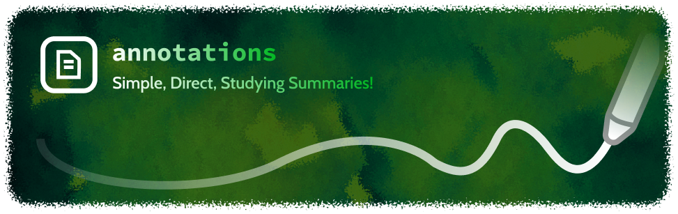

### About 🇦nnotations:
This repository's main objective is to store simple summary of subjects I find studying recently, they aren't necessarily acts as a complete guide or tutorial to learn, but still being a nice indie mind map for everyone who knows about those technologies. You`re allowed to freely use, share and modify from this repository since it was made for studying and educational reasons.
### Instructions ✍️:
To access these guides is very simple, just go explore the folders included in this repository, select your summary and view it like this readme you're seeing it, directly on GitHub, external view in text editor may be distorted. **Just enjoy!**
### Checklist 📝:

Here, I will insert all of the guide's progress, if they're complete, in work or not (❌ Not started, 🧱 Work in Progress, ✅ Stable).

**Application**

+ (🧱) Figma Summary
+ (❌) Godot Summary
+ (❌) Blender Summary
+ (❌) VSCode Summary
+ (❌) GIMP Summary
+ (❌) Inkscape Summary
+ (✅) Git Summary
+ (🧱) Linux Shell Summary
+ (❌) C# Summary
+ (❌) Python Summary
+ (❌) Java Summary
+ (❌) Typescript Summary
+ (❌) HTML/CSS/JS Summary
+ (❌) Node Summary
+ (❌) React Summary
+ (❌) Angular Summary
+ (❌) VueJS Summary

### License 📕:
This repository is licensed under MIT License.
+ https://github.com/phc-s/annotations/blob/main/LICENSE
### Credits 👨‍💻:
- **Pedro Henrique Costa Silva** (https://github.com/phc-s) 
